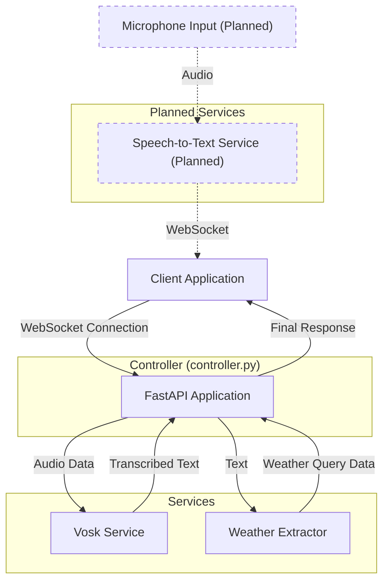

# Python Backend Flowchart

## System Components and Data Flow

## Component Descriptions

### Main Components

1. **FastAPI Application (controller.py)**
   - The main entry point of the application
   - Handles WebSocket connections from clients
   - Coordinates the flow of data between services

2. **Vosk Service (vosk_service.py)**
   - Provides speech recognition functionality
   - Transcribes audio data to text

3. **Weather Extractor (extractorService.py)**
   - Extracts weather-related information from text
   - Identifies location, time period, and whether the query is weather-related

### Planned Components (Not Yet Implemented)

4. **Speech-to-Text Service (speech_to_text_service.py) - Planned**
   - Alternative service for speech recognition
   - Would use microphone input directly
   - Would run its own WebSocket server

### API Endpoints

1. **Root Endpoint ("/")**
   - Simple health check endpoint
   - Returns a message indicating the API is running

2. **Main WebSocket Endpoint ("/ws")**
   - Handles audio data from clients
   - Processes the audio to extract weather queries
   - Returns weather information

## Data Flow

1. **Current Audio Processing Flow**
   - Client sends audio data through WebSocket
   - FastAPI receives the data and saves it to a temporary file
   - Vosk Service transcribes the audio to text
   - FastAPI sends the transcription back to the client
   - Weather Extractor analyzes the text to extract weather query information
   - FastAPI sends the final response back to the client

2. **Current Text Processing Flow**
   - Client sends text directly through WebSocket
   - Weather Extractor analyzes the text to extract weather query information
   - FastAPI sends the response back to the client

### Planned Data Flows (Not Yet Implemented)

3. **Planned Alternative Speech Processing Flow**
   - Speech-to-Text Service would capture audio from the microphone
   - Service would process the audio and detect speech
   - Service would send the transcribed text to connected clients through its WebSocket server
