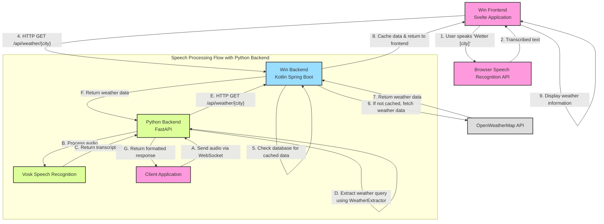

# Application Flowchart

## Component Description

### Win Frontend (Svelte Application)
- **Main File**: `App.svelte`
- **Functionality**: 
  - Provides user interface for weather information
  - Uses browser's built-in Speech Recognition API for voice commands
  - Directly communicates with Win Backend for weather data
  - Processes voice commands to extract city names and fetch weather

### Win Backend (Kotlin Spring Boot)
- **Main Package**: `schwarz.it.lws.win`
- **Key Components**:
  - `WeatherController`: Provides REST API endpoints for weather data
  - `WeatherService`: Handles business logic for fetching and processing weather data
- **Functionality**:
  - Provides weather data via REST API
  - Caches weather data in database
  - Fetches data from OpenWeatherMap API when needed

### Python Backend (FastAPI)
- **Main Files**: `main.py`, `controller.py`, `vosk_service.py`, `extractorService.py`
- **Key Components**:
  - `VoskService`: Handles speech-to-text conversion using Vosk
  - `WeatherExtractor`: Extracts weather queries from text
  - `ConnectionManager`: Manages WebSocket connections
- **Functionality**:
  - Provides WebSocket endpoints for speech processing
  - Transcribes audio using Vosk
  - Extracts weather queries from transcribed text
  - Communicates directly with Win Backend for weather data
  - Supports both audio and text input for testing

## Data Flow

### Browser API Flow
1. User speaks a command like "Wetter Berlin" into the frontend
2. Browser's Speech Recognition API transcribes the audio
3. Frontend extracts the city name from the command
4. Frontend sends HTTP GET request to Win Backend
5. Win Backend checks database for cached weather data
6. If not cached, Win Backend fetches data from OpenWeatherMap API
7. Win Backend returns weather data to Frontend
8. Frontend displays the weather information

### Python Backend Flow
A. Client sends audio data via WebSocket to Python Backend
B. Python Backend uses Vosk for speech-to-text conversion
C. Python Backend extracts weather query from transcribed text using WeatherExtractor
D. Python Backend sends request to Win Backend for weather data
E. Win Backend returns weather data to Python Backend
F. Python Backend formats response and sends it back to client

## Notes
- The Python Backend provides speech-to-text functionality using Vosk
- It offers more control and accuracy compared to the browser's Speech Recognition API
- The Win Backend is the central component for weather data in both flows
- Both frontend implementations (direct browser API and Python Backend) are supported
